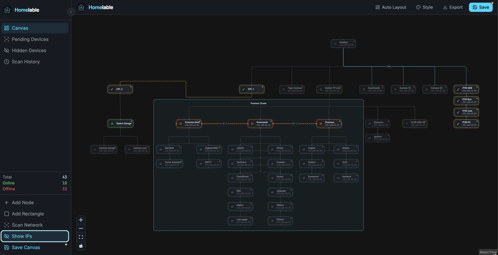
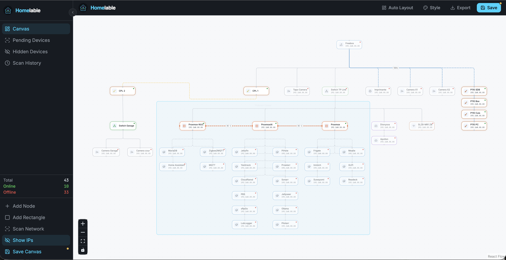
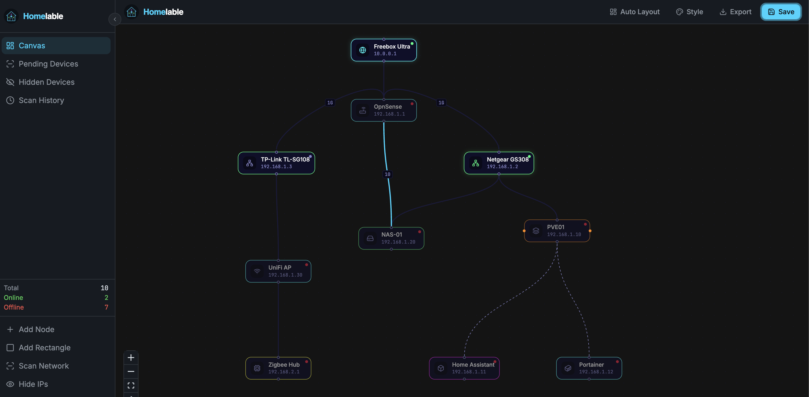

# Homelable

Homelable is a self-hosted infrastructure visualization solution. It provides a network scanning feature to accelerate the identification of machines and services deployed on your local infrastructure.

Homelable also offers a healthcheck system (WIP) through multiple methods (ping/TCP, /health API, etc.) to get a global overview of online/offline services.

You can also select some pre-built design styles, or personalize each device in your diagram.

If you just like the design, you can only run the frontend and export your design as PNG.


---

## Screenshots

<p align="center">
  
  
  
</p>

---

## Installation

Docker, Proxmox LXC, build from source, configuration, and development setup are all covered in **[INSTALLATION.md](./INSTALLATION.md)**.

---

## Network Scanner

The scanner runs `nmap -sV --open` on your configured CIDR ranges and populates a **Pending Devices** queue. From the sidebar you can then approve (adds a node to the canvas), hide, or ignore each discovered device.

### Triggering a scan

To save you time when mapping your infrastructure, Homlable can scan your network and report all the services it detects. It can also identify them, saving you even more time.
Click **Scan Network** in the sidebar. The Scan History tab opens automatically and refreshes every 3 seconds until the scan completes.

### macOS / root privileges

Some nmap scan types (SYN scan, OS detection) require root. If the scan fails with a permissions error, run it manually with sudo using the included script:

```bash
cd backend
sudo python ../scripts/run_scan.py 192.168.1.0/24

# Multiple ranges:
sudo python ../scripts/run_scan.py 192.168.1.0/24 10.0.0.0/24
```

Results are written directly to the database and appear as Pending Devices in the UI without restarting the backend.

> On Linux the backend process itself can be given the `NET_RAW` capability instead of running as root:
> ```bash
> sudo setcap cap_net_raw+ep $(which nmap)
> ```

---

## Node Check Methods

Homelable continuously monitors your nodes and displays their live status (online / offline / unknown) directly on the canvas. Each node can be configured with an independent check method suited to the service it runs.

| Method | Description |
|--------|-------------|
| `ping` | ICMP ping |
| `http` | GET request, success if status < 500 |
| `https` | GET with TLS verify |
| `tcp` | TCP connect (target: `host:port`) |
| `ssh` | TCP connect to port 22 |
| `prometheus` | GET `/metrics` |
| `health` | GET `/health` |

---

## MCP Server (AI Integration) (optionnal)

Homelable can exposes a [Model Context Protocol](https://modelcontextprotocol.io) server so any MCP-compatible AI client (Claude Code, Claude Desktop, Open WebUI…) can read your homelab topology and act on it.

### What the AI can do

| | Action |
|---|---|
| **Read** | List all nodes, edges, full canvas, pending devices, scan history |
| **Write** | Add / update / delete nodes and edges, trigger a network scan, approve or hide discovered devices |

### Setup

**1. Add the keys to your `.env`:**

```env
# Authenticates AI clients (Claude Code, etc.) → MCP server
MCP_API_KEY=mcp_sk_changeme

# Authenticates MCP server → backend (internal Docker network only, never exposed)
MCP_SERVICE_KEY=svc_changeme

# Generate both with:
# python3 -c "import secrets; print(secrets.token_hex(32))"
```

No plain-text passwords involved — `AUTH_PASSWORD_HASH` is only used for the web UI login.

**2. Start the MCP service:**

```bash
docker compose up -d mcp
# MCP server is now listening on http://<your-homelab-ip>:8001
```

**3. Configure your AI client:**

**Claude Code** — run this command in your terminal:
```bash
claude mcp add --transport sse homelable http://<your-homelab-ip>:8001/mcp \
  --header "X-API-Key: mcp_sk_yourkey"
```

Or add it manually to `~/.claude.json`:
```json
{
  "mcpServers": {
    "homelable": {
      "type": "sse",
      "url": "http://<your-homelab-ip>:8001/mcp",
      "headers": {
        "X-API-Key": "mcp_sk_yourkey"
      }
    }
  }
}
```

**Claude Desktop** — edit `~/Library/Application Support/Claude/claude_desktop_config.json` (macOS) or `%APPDATA%\Claude\claude_desktop_config.json` (Windows):
```json
{
  "mcpServers": {
    "homelable": {
      "type": "sse",
      "url": "http://<your-homelab-ip>:8001/mcp",
      "headers": {
        "X-API-Key": "mcp_sk_yourkey"
      }
    }
  }
}
```

### Example prompts

- *"What nodes are currently offline?"*
- *"Add a new LXC container named `pihole` at 192.168.1.5, connected to my switch."*
- *"Trigger a network scan on 192.168.1.0/24 and show me the pending devices."*
- *"Show me the full canvas topology."*

### Security

- The MCP server is **not** intended to be exposed to the internet — keep port 8001 firewalled to your LAN.
- Rotate the key any time by updating `MCP_API_KEY` in `.env` and restarting: `docker compose restart mcp`.
- The MCP server communicates with the backend over the internal Docker network — the backend API is never directly exposed to MCP clients.

---
